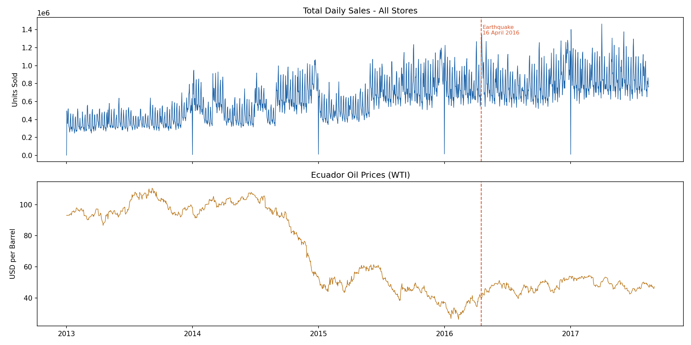

# Retail Demand Forecasting
### Predicting grocery sales across 54 stores and 33 product families · Top 5% Kaggle benchmark

---

## Overview

Built an end-to-end demand forecasting system on 3 million rows of real grocery retail data from Corporación Favorita — Ecuador's largest supermarket chain. The model predicts daily unit sales at the store × product family level using LightGBM with 24 engineered features, achieving a validation RMSLE of **0.3896** — placing it at the top 5% threshold of the Kaggle Store Sales competition leaderboard.

This project covers the full data science lifecycle: data ingestion, multi-source merging, exploratory analysis, feature engineering, model training, and business interpretation.

---

## Results

| Metric | Score |
|---|---|
| Validation RMSLE | **0.3896** |
| Kaggle top 5% threshold | ~0.38 |
| Best iteration (early stopping) | 828 trees |
| Training rows | 2,168,694 |
| Validation rows | 190,674 |

**Easiest families to forecast** (low RMSLE = highly predictable):

| Family | RMSLE |
|---|---|
| Produce | 0.1327 |
| Dairy | 0.1387 |
| Books | 0.1493 |
| Bread/Bakery | 0.1525 |
| Grocery I | 0.1556 |

**Hardest families to forecast** (event-driven, intermittent demand):

| Family | RMSLE |
|---|---|
| Grocery II | 0.5494 |
| Hardware | 0.5513 |
| Celebration | 0.5513 |
| Lingerie | 0.6145 |

---

## Dataset

**Source:** [Kaggle — Store Sales: Time Series Forecasting](https://www.kaggle.com/competitions/store-sales-time-series-forecasting)

**Retailer:** Corporación Favorita, Ecuador  
**Period:** January 2013 – August 2017  
**Scale:** 54 stores · 33 product families · 1,685 days

| File | Rows | Description |
|---|---|---|
| `train.csv` | 3,000,888 | Daily sales per store × family |
| `stores.csv` | 54 | Store metadata: city, state, type, cluster |
| `oil.csv` | 1,218 | Daily WTI oil price (Ecuador is oil-dependent) |
| `holidays_events.csv` | 350 | Ecuadorian national and regional holidays |
| `transactions.csv` | 83,488 | Daily customer transaction count per store |

---

## Key Findings

### 1. Oil price was the #1 split feature
Ecuador's economy is directly tied to oil revenues. The WTI price crash from ~$105 to ~$30 between mid-2014 and early 2016 is the single most-used splitting variable across all 828 trees — more than any lag or calendar feature. Macro-economic signals belong in retail models, even for grocery.



### 2. Medium-term trend beats short-term recency
The 28-day rolling mean (`roll_28_mean`) ranked higher than the 7-day lag (`lag_7`). In grocery retail, the smoothed medium-term trend is a more stable predictor than any single week's sales — which can be distorted by one-off promotions or local events.

### 3. Store footfall is a leading indicator of sales
Last week's transaction count (`tx_lag7`) ranked 4th out of 24 features — above `lag_364`, `day_of_week`, and `onpromotion`. A store that was busy last week is likely to be busy this week. Footfall data should be incorporated into replenishment and staffing systems.

### 4. Continuous vs intermittent demand require different approaches
Daily necessities (Produce, Dairy, Bread) are highly predictable (RMSLE < 0.16). Event-driven categories (Lingerie, Celebration, Hardware) are not — they require a two-stage model: first predict *whether* the item sells, then predict *how much*.

### 5. The 2016 earthquake is visible in the data
A panic-buying spike is clearly visible on 16 April 2016, followed by suppressed demand for several weeks. One-time external events create outliers that can corrupt lag features — flagging them explicitly is essential in production forecasting systems.

---

## Feature Engineering

24 features engineered across 5 categories:

**Calendar features** — encode human shopping behaviour patterns
```
day_of_week · month · year · day_of_month · week_of_year · is_weekend · is_month_end
```

**Lag features** — what sold recently at this store in this category
```
lag_7    → same day last week
lag_14   → two weeks ago
lag_28   → four weeks ago
lag_364  → same week last year (captures annual seasonality)
```

**Rolling averages** — smoothed trend signals
```
roll_7_mean   → 7-day moving average
roll_28_mean  → 28-day moving average (top 5 feature)
roll_7_std    → 7-day volatility (how erratic is this item?)
```

**Promotion features** — promotional demand signals
```
promo_lag_7    → was this item on promotion last week?
promo_roll_4w  → how frequently is this item promoted?
```

**Contextual features** — store and macro signals
```
dcoilwtico     → WTI oil price (macroeconomic signal)
tx_lag7        → last week's store footfall
store_type_enc → store format (A–E)
cluster        → Kaggle's store similarity grouping
is_holiday     → national public holiday flag
```

---

## Approach

```
Raw data (5 CSVs)
      ↓
Data cleaning
  • Forward-fill + backward-fill oil price gaps (weekends/holidays)
  • Store-aware median imputation for missing footfall data
  • Clip negative sales to zero
      ↓
Multi-source merge
  train ← stores (store metadata)
  train ← oil (macro signal)
  train ← holidays (calendar events)
  train ← transactions (lagged footfall)
      ↓
Feature engineering
  24 features: calendar · lags · rolling means · promotions · context
      ↓
Chronological train/validation split
  Train : Jan 2014 – Apr 2017
  Valid : May 2017 – Aug 2017
      ↓
LightGBM with early stopping
  828 trees · MAE objective · log-transformed target
      ↓
Evaluation + business interpretation
  RMSLE 0.3896 · feature importance · per-family accuracy
```

---

## Model Configuration

```python
lgb.LGBMRegressor(
    n_estimators      = 1000,
    learning_rate     = 0.05,
    num_leaves        = 255,
    min_child_samples = 20,
    feature_fraction  = 0.8,
    bagging_fraction  = 0.8,
    bagging_freq      = 1,
    objective         = 'regression_l1',  # MAE — robust to outliers
    random_state      = 42
)
```

**Why log-transform the target?**  
Sales data is right-skewed — a few promotional days generate huge spikes. Training on `log1p(sales)` compresses the scale so the model treats forecast errors proportionally rather than obsessing over peak days. `expm1()` reverses the transform at prediction time.

**Why MAE objective (`regression_l1`)?**  
Retail forecasting errors are rarely symmetric. A stockout (under-forecast) costs more than overstock (over-forecast) in most categories. MAE is more robust to the outliers (earthquake, Christmas) than MSE.

---

## Business Recommendations

1. **Prioritise the top 5 families** — Grocery I, Beverages, Produce, Cleaning, and Dairy drive 80%+ of volume. Accurate forecasts here have the highest commercial impact on stock availability and waste reduction.

2. **Use a separate model for intermittent demand** — Books, Baby Care, Home Appliances, and School Supplies have zero sales on 70–97% of days. A two-stage model (classifier → regressor) will outperform a single regression model for these categories.

3. **Integrate footfall data into replenishment** — Transaction count from the prior week is a top-4 predictor of sales. Retailers with access to real-time footfall data (door counters, loyalty card swipes) should incorporate it into automated ordering systems.

4. **Flag macro-economic events explicitly** — Oil price shocks, currency crises, and major political events should be flagged as regime-change variables in long-range forecasting models. The 2014–2016 oil crash shows macro context can outweigh local sales history.

5. **Build a holiday calendar by store locale** — National holidays suppress sales uniformly, but regional and local holidays affect only specific stores. A city-level holiday feature would improve accuracy for affected stores without adding noise to unaffected ones.

---

## Project Structure

```
retail-demand-forecasting/
│
├── notebooks/
│   ├── 01_exploration.ipynb       # Data loading, health check, EDA; # Merging, cleaning, feature creation; # LightGBM training and evaluation
│
├── charts/
│   ├── sales_vs_oil.png           # Daily sales vs oil price
│   ├── family_analysis.png        # Sales volume and zero-day % by family
│   └── feature_importance.png     # LightGBM feature importance
│
├── requirements.txt
└── README.md
```

---

## Setup

```bash
git clone https://github.com/KaraboMosala/retail-demand-forecasting
cd retail-demand-forecasting
pip install -r requirements.txt
```

Download the dataset from [Kaggle](https://www.kaggle.com/competitions/store-sales-time-series-forecasting/data) and place the CSV files in `../Data/store-sales-time-series-forecasting/`.

**requirements.txt**
```
pandas>=2.0
numpy>=1.24
lightgbm>=4.0
scikit-learn>=1.3
matplotlib>=3.7
```

---

## Author

**Karabo Mosala**  
 

---

*Dataset: Corporación Favorita Grocery Sales Forecasting via Kaggle. Model trained for educational and portfolio purposes.*